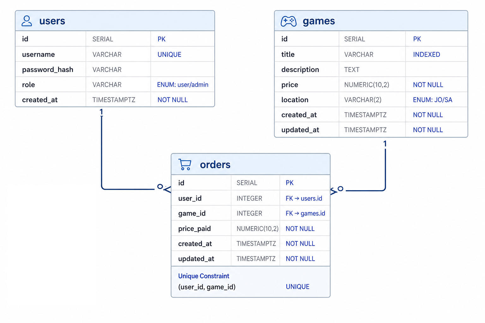

# Game Store API

Backend for a small digital game store. Users can browse games, buy them once, and view their orders. Admins can import the catalog from CSV and tweak individual games.

Built with **FastAPI**, **SQLModel**, and **PostgreSQL**.

---

## Running the app

Once Postgres is up, migrations are applied, and your `.env` is in place:

```bash
uvicorn app.main:app --reload --host 0.0.0.0 --port 8080
```

The API will be at **[http://localhost:8080](http://localhost:8080)**. Interactive docs live at **[http://localhost:8080/docs](http://localhost:8080/docs)**.

---

## First-time setup

You'll need **Python 3.14+**, **Poetry**, and **Docker**.

**1. Clone and install dependencies**

```bash
poetry install
```

**2. Environment variables**

```bash
cp .env.example .env
```

Fill in the values at minimum Postgres credentials, `SECRET_KEY`, and the admin credentials (`ADMIN_USERNAME` / `ADMIN_PASSWORD`). The admin user is created automatically on startup if it doesn't exist yet.

**3. Start Postgres**

```bash
docker compose up -d
```

**4. Run migrations**

```bash
poetry run alembic upgrade head
```

**5. Load the game catalog**

A sample CSV ships with the repo at `data/items.csv`:

```bash
poetry run python -m scripts.import_games data/items.csv --replace
```

Use `--replace` to wipe existing games first. Skip it if you're appending. If orders already reference games, replace will fail, that's intentional.

**6. Start the server** (see command above)

---


## Project structure

```
game-store-api/
├── app/
│   ├── main.py                 # FastAPI app, CORS, lifespan, health check
│   ├── api/router.py           # Mounts all module routers under /api
│   ├── config/                 # pydantic-settings (env vars, DB URL)
│   ├── core/auth/              # JWT helpers + auth dependencies
│   ├── bootstrap/              # Admin user seeding on startup
│   ├── database/
│   │   ├── models.py           # User, Game, Order
│   │   ├── database.py         # Async engine + session factory
│   │   └── repositories/       # Data access layer
│   ├── modules/
│   │   ├── auth/               # Register + login
│   │   ├── games/              # Browse catalog, view purchased games
│   │   ├── orders/             # Purchase flow + order history
│   │   └── admin/              # CSV import + game updates
│   └── utils/
│       └── csv_parser.py       # Shared CSV parsing logic
├── scripts/
│   └── import_games.py         # CLI to load CSV into the DB (again, not needed since there is an endpoint for that)
├── migrations/                 # Alembic migrations
├── data/
│   └── items.csv               # Sample catalog (100 rows)
├── docs/
│   └── db-schema.png           # ER diagram
├── compose.yml                 # Postgres only
└── pyproject.toml
```

Each feature module follows the same shape: **router** (HTTP) → **service** (business logic) → **repository** (database). Schemas and domain exceptions sit alongside.

---


## Architecture decisions


### Why PostgreSQL?

The assignment CSV has relational data (users, games, orders) with foreign keys and a uniqueness rule (one purchase per user per game). Postgres handles that cleanly, supports proper migrations via Alembic, and is what I'd reach for in anything beyond a toy prototype. SQLite would work for local dev alone, but I wanted something closer to a real deployment.

### Async all the way through

FastAPI + `asyncpg` + SQLAlchemy async sessions. Repositories never commit on their own the service layer owns the transaction boundary. That matters for purchase: read the game price and write the order in one commit.

### Module-per-domain

`auth`, `games`, `orders`, and `admin` are separate folders instead of one giant `routes.py`. Keeps things readable as the API grows and matches how I'd split a larger codebase.

### JWT auth with Bearer tokens

Login returns a JWT. Every protected route expects `Authorization: Bearer <token>`. Swagger uses HTTP Bearer auth, log in via `/api/auth/login`, copy the `access_token`, paste it in the Authorize dialog.

Normal users register themselves. Only the admin is seeded from env vars on startup.

### CSV import: script + admin endpoint

The assignment asks for an import script, so there's `scripts/import_games.py`. Parsing lives in `app/utils/csv_parser.py` and is reused by the admin upload endpoint (`POST /api/admin/games/import`). One parser, two entry points.

The CSV `id` column is ignored, DB ids are auto-generated. Duplicate titles in the CSV are fine (the sample file has 10 titles × 10 price variants).

### Purchase rules

- One game per purchase request
- A user can buy the same game **at most once** (enforced by a unique constraint on `orders(user_id, game_id)` plus a check in the service layer)
- `price_paid` is snapshotted at purchase time so receipt amounts don't change if an admin edits the catalog later


### Pagination defaults

`GET /api/games` defaults to `page=1`, `size=20` (max 100). Optional `location` filter accepts `JO` or `SA`.

---


## Database schema



| Table      | Purpose                                                      |
| ---------- | ------------------------------------------------------------ |
| **users**  | Accounts with hashed passwords and a `user` / `admin` role   |
| **games**  | Catalog items with title, description, price, and location   |
| **orders** | Purchase records linking a user to a game, with `price_paid` |


Relationships: a user has many orders, a game has many orders. The unique constraint on `(user_id, game_id)` is what stops double-purchases.

Migrations live in `migrations/versions/`. Current head: run `alembic current` to check.

---


## API overview

All routes under `/api` except `/health`.


| Method | Path                      | Auth  | Description                                  |
| ------ | ------------------------- | ----- | -------------------------------------------- |
| POST   | `/api/auth/register`      | —     | Create a user account                        |
| POST   | `/api/auth/login`         | —     | Get a JWT                                    |
| GET    | `/api/games`              | User  | Paginated catalog (`?page=&size=&location=`) |
| GET    | `/api/games/purchased`    | User  | Games you've bought                          |
| GET    | `/api/games/{id}`         | User  | Single game details                          |
| POST   | `/api/orders`             | User  | Buy a game (`{ "game_id": 1 }`)              |
| GET    | `/api/orders`             | User  | Your order history                           |
| GET    | `/api/orders/{id}`        | User  | Single order (receipt)                       |
| POST   | `/api/admin/games/import` | Admin | Upload CSV (`replace` query param)           |
| PATCH  | `/api/admin/games/{id}`   | Admin | Update a game                                |
| GET    | `/health`                 | —     | Health check                                 |


Full request/response shapes are in the OpenAPI docs at `/docs`.

---


## Assumptions & notes

- **Frontend is separate.** This repo is the backend only. CORS is configured via `ALLOWED_ORIGINS` (defaults to `http://localhost:3000` for a local React/Next app).
- **No game deletion endpoint.** Admins can replace the whole catalog via CSV import, but individual deletes aren't exposed, avoids orphaning order history.
- **Register is open.** Anyone can sign up as a regular user. Admin role is only assigned via the startup seed (or manual DB update).

---


## Quick test flow

1. Start the server
2. `POST /api/auth/login` with your admin credentials → copy token
3. Authorize in `/docs` with the Bearer token
4. Import games (if you haven't run the script): `POST /api/admin/games/import`
5. `POST /api/auth/register` a normal user, log in as them
6. `GET /api/games` → pick an id → `POST /api/orders` with that `game_id`
7. `GET /api/orders/{id}` for the receipt

